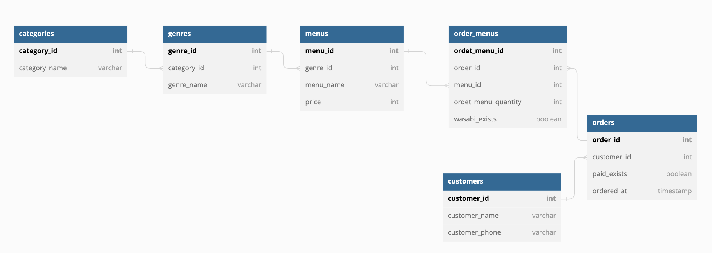
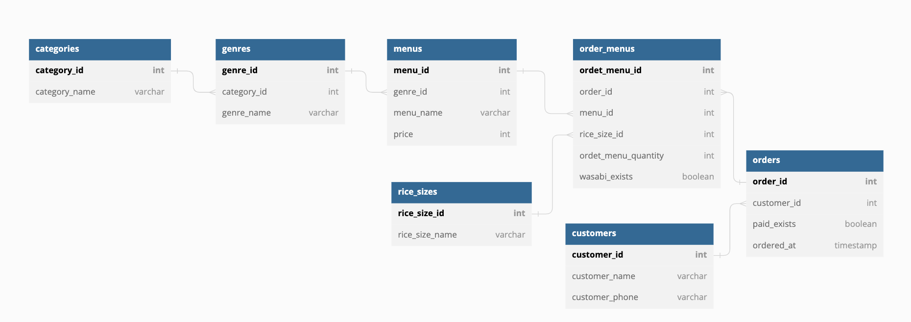
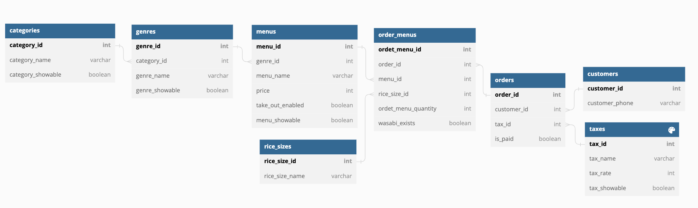
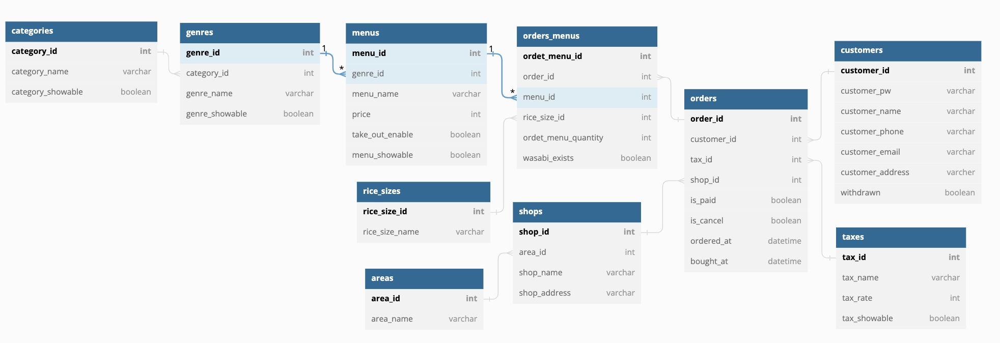

## 課題1

1. categoriesテーブル ・セットメニュー ・お好みすし ・その他 などを保存するテーブル
2. genresテーブル ・盛り込み ・一皿 100円（税別）などを保存するテーブル
3. menusテーブル ・商品名と金額 を保存するテーブル
4. order_menusテーブル ordersとmenusの中間テーブル  ・注文番号 ・商品番号 ・注文された商品の個数 ・わさびの有無 を保存するテーブル
5. ordersテーブル ・顧客番号 ・支払ったかどうか ・注文日 を保存するテーブル
6. customersテーブル ・顧客の名前 ・電話番号を保存する

## 任意課題
概念モデル
必要な情報の選定と管理すべき情報（エンティティと属性）と関係を整理したモデル
ER図が該当

論理モデルとは
概念モデルをリレーショナルデータモデルで取り扱いやすいように詳細化したモデル
→多対多の分解、キーの整理、正規化をしたもの

物理モデルとは
論理モデルをテーブルに落とし込むためにさらに詳細に表したモデル
→物理名の決定、型・制約の決定、インデックスの決定

## 課題2

追加した部分
1. rice_sizesテーブル ・シャリのサイズ を保存するテーブル
2. order_menusテーブルにrice_sizesテーブルの主キーを外部キーとして追加

各お好み寿司ごとの売上
select menu_name, sum(price * ordet_menu_quantity) as "売上高（税抜き）" from praha_sushi.orders 
  inner join praha_sushi.order_menus Using(order_id) 
  inner join praha_sushi.menus Using(menu_id)
  inner join praha_sushi.genres  Using(genre_id) 
  inner join praha_sushi.categories  Using(category_id) 
  where category_id = 2
  group by menu_id order by sum(price * ordet_menu_quantity) desc;

## 課題3
追加使用（個人）
1. 消費税改正が起きた場合
2. 大カテゴリー、小カテゴリー、メニュー自体などが増えた場合

追加した部分
1. taxesテーブル ・税率 を保存するテーブル
2. ordersテーブルにtaxesテーブルの主キーを外部キーとして追加
3. categories、genres、taxesテーブルに非表示フラグ 〇〇_showableというカラムを追加

追加使用（トリオ）
1. 複数店舗があった場合
2. 持ち帰れない商品と持ち変えられる商品を分けて表示したい場合
3. 顧客がネットで注文できるようにする場合（注文日時と受け渡し日時、注文の変更やキャンセル、論理削除）

追加した部分
1. shopsテーブル ・店名 ・住所 を保存するテーブル
2. areasテーブル ・エリア名 を保存するテーブル
→ エリアごとの店舗でデータを分析する用
3. ordersテーブルにshopsテーブルの主キーを外部キーとして追加
4. customersテーブルに ・メールアドレス ・パスワード ・住所 ・退会済みフラグ を保存するカラムを追加

## 課題4
お客さんが会計をする際の最終的な支払金額（税抜き）
SELECT order_id, sum(price * ordet_menu_quantity) as "税抜き合計" FROM praha_sushi.orders 
  inner join praha_sushi.order_menus Using(order_id)
  inner join praha_sushi.menus Using(menu_id) group by order_id;

お客さんが会計をする際の最終的な支払金額（税込）
SELECT order_id, FLOOR(sum(price * ordet_menu_quantity)*tax_rate) as "税込合計" FROM praha_sushi.orders
  inner join praha_sushi.taxes Using(tax_id)
  inner join praha_sushi.order_menus Using(order_id)
  inner join praha_sushi.menus Using(menu_id) group by order_id;

合計皿数
SELECT order_id, sum(ordet_menu_quantity) as "皿数合計" FROM praha_sushi.orders
  inner join praha_sushi.order_menus Using(order_id)
  inner join praha_sushi.menus Using(menu_id)
  inner join praha_sushi.genres Using(genre_id) 
  inner join praha_sushi.categories Using(category_id)
  where category_id = 2 group by order_id;

特定の期間内（今回は一ヶ月間）のお客さんの注文回数のランキング
SELECT customer_id, customer_name, count(*) FROM praha_sushi.orders ord 
  inner join praha_sushi.customers Using(customer_id)
  WHERE ordered_at BETWEEN '2022-11-01 00:00:00' AND '2022-11-30 23:59:59'
  group by customer_id order by count(*) desc;

各ジャンル毎の売上高（税抜き）
SELECT genre_name, sum(price * ordet_menu_quantity) as "売上高（税抜き）" FROM praha_sushi.orders
  inner join praha_sushi.order_menus Using(order_id)
  inner join praha_sushi.menus Using(menu_id)
  inner join praha_sushi.genres  Using(genre_id) 
  group by genre_id order by sum(price * ordet_menu_quantity) desc;

支払いが済んでいないお客さん一覧
SELECT customer_name, customer_phone FROM praha_sushi.orders
  inner join praha_sushi.customers Using(customer_id)
  where is_paid = 0