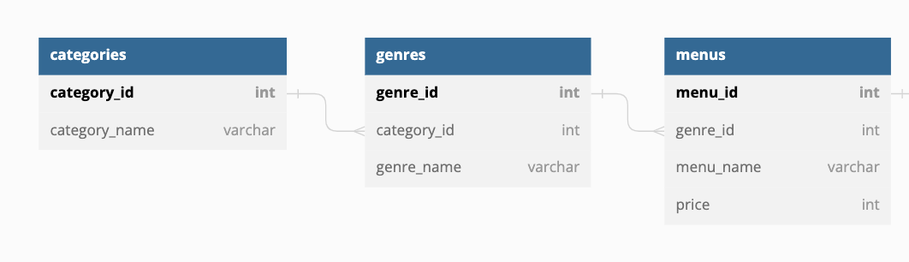
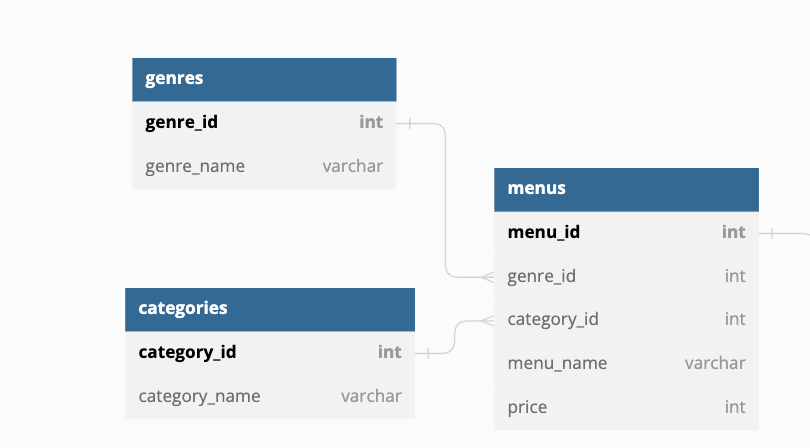

# 課題1
RDB のメリットとデメリット
メリット
1. 標準化されたデータ構造と操作方法
2. データの検索や更新が高速で容易
3. データ完全性や一貫性を保証するための制約を定義できる
4. 複雑なデータの関係性を明確に表現できる
5. データを複数のアプリケーションやユーザーが共有したり統合したりすることが容易
6. スケーラビリティが高く、大量のデータを処理できる

デメリット
1. 高価であるため、小規模な企業や個人には手が出しにくい。
2. 学習コストが高いため、スキルを身につけるのに時間がかかる。
3. スキーマを定義する必要があり、データの挿入や更新が非常に複雑である。
4. データベースを適切に管理するために、専門的なスキルが必要である。
5. パフォーマンスが低下する可能性がある。大量のデータを扱う場合、RDBは遅くなることがある。
6. スキーマ変更が困難であるため、アプリケーションが拡張される場合、スキーマ変更が必要になるが、この変更は非常に難しい。
7. 不正アクセスやセキュリティ上の問題がある可能性があるため、適切なセキュリティ対策が必要である。
8. データの重複が発生する可能性があるため、データの品質を保つことが難しい。

データの完全性
データベース内に存在するデータが正しく、有効であることを指します。
つまり、データが本来持つべき情報を全て含んでおり、データを扱う際に発生する問題やエラーがない状態のことです。

データ一貫性
データベース内のデータがお互いに矛盾しないことを指します。
つまり、データが他のデータと矛盾しないように、適切な制約やルールを設定して管理することで、データの一貫性を保つことができます。

データ完全性や一貫性は、データベースの品質を保つために重要であり、データベースの管理者はそれらを適切に管理する必要があります。

### データの完全性などの参考
https://www.talend.com/jp/resources/what-is-data-integrity/

データベースを適切に管理するために、専門的なスキルとは
1. データベースの種類や構造、特徴についての知識。
2. SQLや他のデータベース言語を使用したクエリや操作の知識。
3. データベースのスキーマや設計についての知識。
4. データベースのパフォーマンスやスケーラビリティについての知識。
5. データベースのセキュリティやデータ保護についての知識。
6. データベースの管理や運用、トラブルシューティングについての知識。
7. データベースを活用したアプリケーション開発やデータ分析の知識。

データベースを設計するためには、データモデリングや正規化などの知識が必要です。
また、データを保存するためには、データベースの種類や設計方法、セキュリティ対策などを理解する必要があります。
さらに、データベースを運用するためには、データの管理や検索、更新などを行うためのクエリ言語やツールの知識が必要です。

## 疑問
created_atやupdated_atを使用するべきか？
使用するメリット
全てにつけておけば、後から作成日などを使用したくなった時に使える
作成日などでデータの絞り込みをすることができる

使用するデメリット
YAGNIに違反している
余分なカラムが増えて、データが重くなる

使用しないメリット
意味がわかるカラムしか残らない(作成日が知りたい場合はpubulished_atなどとする)ため、誰が見てもわかるテーブルとなる
同じテーブルのupdated_atやcreated_atに複数の意味づけをさせるようなことがなくなる

使用しないデメリット
あとから、作成日が必要になった時にスキーマの再構築が必要

※ updated_atなどtimestampは楽観ロックのキーに使用することもできる（推奨はされない）
楽観ロックとは「他者と同時更新は起きないという前提のもとにする排他制御」のこと
### 参考
https://qiita.com/NagaokaKenichi/items/73040df85b7bd4e9ecfc

## 結論
created_atやupdated_atは使用しない
ただし、イベントテーブルに対して日時の情報をもたせるが、モノに対しては日時の情報をもたせないこと
※ システムで扱う情報はモノ(リソース)とコト(イベント)に分類することができる

### created_atやupdated_atは使用しない意見の参考記事
https://tech.notti.link/6dcafda

### 参考
postgresqlのサンプルデータのスキーマ
https://www.postgresqltutorial.com/postgresql-getting-started/postgresql-sample-database/

## 疑問
categoriesテーブルとgenresテーブルの関係性をどうした方がいいのか？
例1 categoriesテーブルとgenresテーブルは従属関係にある

例2 categoriesテーブルとgenresテーブルは並列関係にある

例1のメリット（例2のデメリット）
categoryの一部としてgenreがあるということが明確になる
データの一貫性が守られる（基本的にはcategoryの中にgenreが入る形なのに、categoryに指定されたgenreが保存されることがない）
例 お好みすし の中にある 一皿 100円（税別）としたいのに、例2の場合では誤ってmenusに セットメニュー、一皿 100円（税別）となる場合が起こりうる

例1のデメリット（例2のメリット）
categoryの分類が変わった際にそれぞれのcategoryに紐づいたgenreのデータとして入れ直さないといけない

## 結論
→ 例1を使用する
理由
RDBを使用するメリットがデータ完全性や一貫性を保証するための制約を定義できることということなのに、
例2を使用するとそれが意味をなさなくなるので例1を使用した方が良い！
あとはER図で関係性がわかるのも助かる

# 任意課題
このことを知るメリットは作業の順番が明確になること

### データモデルの分類の参考
https://zenn.dev/umi_mori/books/331c0c9ef9e5f0/viewer/110b8e

# 課題2
## 疑問
rice_sizesテーブルのようなレコード数が少ないマスタテーブルを作成した方がいいのか？または、バックエンドに定数として保持した方がよいのか？

マスターテーブルのメリット
整合性がとれる

マスターテーブルのデメリット
joinにはコストがかかる
例: 10万と30万のレコードをjoinした場合
インデックスを使用しない場合 400ms
一つのテーブルにまとめた場合 20ms
インデックスを使用した場合 40ms
### joinのパフォーマンスの参考
https://qiita.com/k_kind/items/76299127cf6c7531f700

バックエンド側定数のメリット
テーブルの作成や維持のコストがなくなる

バックエンド側定数のデメリット
アプリ開発の経験がない人が開発にjoinした際に誤ったコーディングをする可能性がある

## 結論
マスターテーブルとバックエンドの定数を両方使う
バックエンド側の定数のやり方例
https://stackblitz.com/edit/node-1dckvz?file=index.ts

# 課題3
## 疑問
論理削除を追加するしてもいいのか
論理削除用のカラム追加による複雑化が起きる
→ select時やjoin時に毎回論理削除フラグを考慮しないといけなく、書き忘れなどが発生し不具合に繋がる
現実世界には削除というものが存在しないはずだから、何のためかをヒアリングで明確にする必要がある
※ 論理削除か物理削除という判断は、最終手段

## 結論
本当に必要だと考えられるのであれば、入れるといいが、安易に実装しないこと 

### 補足
論理削除を入れるメリット
1. データの復元が可能である。論理削除されたデータは、削除されたことを論理的に表現するだけであり、実際にデータベースから削除されないため、後で復元することが可能です。
2. 削除済みデータを区別することができる。論理削除されたデータは、フラグなどを使って区別することができるため、実際に削除されたデータとは別のものとして扱うことができます。
3. 削除したデータを履歴として保存することができる。論理削除されたデータは、削除する前の内容を保存したままであるため、データの履歴を保存することができます。
4. データベースの性能を向上させることができる。論理削除されたデータは、データベースから削除されないため、データベースの検索や更新などの処理が速くなります。

論理削除を入れるデメリット
1. データの削除が遅くなる。論理削除されたデータは、実際にデータベースから削除されないため、データベースから完全に削除するには、論理削除されたフラグを見て、対象データを検索し、それらを実際に削除する必要があります。これにより、データの削除処理が遅くなります。
2. データベースのサイズが大きくなる。論理削除されたデータは、実際にデータベースから削除されないため、データベース内に残ったままであるため、データベースのサイズが大きくなります。
3. データの品質が下がる可能性がある。論理削除されたデータは、実際にデータベースから削除されないため、データベース内に重複したデータが残ったままであるため、データの品質が下がる可能性があります。
4. 不要なデータが増える。論理削除されたデータは、実際にデータベースから削除されないため、不要なデータがデータベース内に残り続けることになります。
5. データベースの性能が低下する可能性がある。論理削除されたデータは、実際にデータベースから削除されないため、データベース内に残ったままであるため、データベースの検索や更新などの処理が遅くなる可能性があります。

「論理削除」と「現在無効」や「非表示」の違い
「現在無効」とは、そのデータが現在使用されていないことを意味します。ただし、そのデータはデータベースには存在し、後で使用する可能性があるため、削除しないで残します。

「非表示」とは、そのデータが一時的に表示されないようにすることを意味します。ただし、そのデータはデータベースには存在し、今後使用する可能性があるため、削除しません。

「論理削除」とは、そのデータがデータベースから削除されたことを論理的に表現することを意味します。ただし、そのデータは実際にはデータベースから削除されず、フラグなどを使って削除されたことを示すようにします。これにより、後で復元することが可能です。

これらの意味の違いは、データが実際にデータベースから削除されるかどうかにあります。「現在無効」や「非表示」では、データがデータベースから削除されず、「論理削除」では、データがデータベースから削除されることを示します。

# 課題4
## 疑問
データベースのカラム名は一意にした方がいいのか

全てのカラムを一意
一部のみを一意
気にしない

カラム名が同じ時のデメリット
複数のテーブルで同じカラム名を使用している場合、それらのテーブルを結合する際に問題が発生する可能性がある
Joinして同じ絡む名があった時にはテーブル名を指定する必要がある
例: SELECT テーブル1.カラム1, テーブル2.カラム1, ... FROM テーブル1 INNER JOIN テーブル2 ON 条件

他のカラムとの区別がつきやすくなる
特定のRDBMSではUsingが使用でき、それでクエリを短くすることもできる

デメリット
クエリを書く際に長くなることもある

その他
アプリで扱うときにモデルに記述する場合は、モデルのオブジェクトを操作するので、どちらでも良い？

### 参考
一部のみを一意にして基本的にはしない
https://sisense.gaprise.jp/blog/0032

## 疑問
中間テーブルの名前はどうした方がいいのか？

メリット

### 参考
中間テーブル名は意味のあるものにする
https://qiita.com/tkawa/items/dc3e313021f32fd91ca6
中間テーブルは二つのテーブルをくっつけたもの（今回の課題のorders_menusみたいな）にする
https://sisense.gaprise.jp/blog/0032

### 参考
SQLスキーマの改善方法
1. 不要なカラムやテーブルを削除する
2. カラムやテーブルの名前をわかりやすいものに変更する
3. カラムやテーブルを適切な型に変換する
4. テーブルを適切に正規化する
5. インデックスを追加することでクエリのパフォーマンスを改善する
また、スキーマを改善するためには、データベースを適切に設計することが重要です。
データベースを設計する際には、データをどのように格納し、どのようなクエリを実行するかを考慮しなければなりません。
これらを考慮してスキーマを設計することで、スキーマを改善することができます。

## docker関連の参考
docker の参考 https://qiita.com/moaikids/items/f7c0db2c98425094ef10
SQL文(CREATE DATABASE)の参考 https://qiita.com/ryosuketter/items/713c7046314ecdf1a4a9
csvファイルデータのインポートの参考 https://taiga.hatenadiary.com/entry/2018/02/11/181715
SQL文（LOAD DATA LOCAL INFILE）の参考 https://agohack.com/import-csv-files-load-data-local-infile/
SQL文（LOAD DATA LOCAL INFILE）の参考 https://yoku0825.blogspot.com/2018/02/load-data-infile.html
シェルスクリプト実行時の権限エラーの参考 https://qiita.com/kiririri/items/81a828befc54e188d776
外部キー制約に関しての参考 https://zenn.dev/praha/articles/2667cbb1ab7233

# dockerを立ち上げるときの操作と注意点
mysqlを使用するときは DBモデリング1 を current directory にした状態で docker-compose build --no-cache && docker-compose up をする
※ サンプルデータを入れ直したいときはdataの中身を削除してから
※ docker start でも良いが、mysql と phpmyadmin が別コンテナなので、両方起動する必要がある

キャッシュを作らずにコンポーネントを起動させる方法
docker-compose build --no-cache && docker-compose up

phpmyadminのurlは localhost:8080

※ docker mysqlは起動時に勝手にlocalのvloumeを作成している（volumeでデータの保存場所を指定しない場合）

dockerのenvに関すること
docker-compose.ymlではenv_file:で指定したファイルの内容が入る（ただし、.envファイルであれば、指定がなくても入る）
下記のような場合ではenvironmentが存在すると(.envが存在しないとき)MYSQL_ROOT_USER: ''となる
   environment:
     	MYSQL_ROOT_USER: ${MYSQL_ROOT_USER}
     	MYSQL_ROOT_PASSWORD: ${MYSQL_ROOT_PASSWORD}
    env_file:
      - ./.env_mysql
※ docker-mysqlではenvironmentでMYSQL_ROOT_USERやMYSQL_ROOT_PASSWORDに設定した値がそのままmysqlのpasswordとなる

# その他
## 設計に関する注意点
データベースはリスク多めに見積もる
拡張性を重視する
データベースは容易に変更ができない。特に、１つのテーブルを分割する際とても大変
データベースのリファクタリングは大変
データ分析観点から、テーブルは分けて欲しい

## カラム名
真偽値を返す関数のネーミング
https://qiita.com/yskszk/items/5a7f99c974773f03a82a

## データの型
### 疑問
timestampとdatetimeのどちらの方がいいのか

timestampのメリット
MySQL 5.6.5 以前では timestampのみが 現在の日付および時間 デフォルト値や自動更新値として入れられる
（MySQL 5.6.5 以降では datetimeもtimestampも両方ともできる）
ストレージでは現在のタイムゾーンを UTC に変換し、取得では UTC から現在のタイムゾーンへの変換を自動でしてくれる

timestampのデメリット
mysqlでは2038年問題が存在する（'1970-01-01 00:00:01' UTC から '2038-01-19 03:14:07' UTC の範囲をサポート）
(postgresではない)

datetimeのメリット
9999年までサポートしている（'1000-01-01 00:00:00' から '9999-12-31 23:59:59'の範囲をサポート）

datetimeのデメリット
timezoneを設定できない

### 結論
datatimeが良い
理由
基本的に時間はUTCを使用した方がいいため
UTC以外を使うと発生する問題
1. データが不正確になる。UTC以外のタイムゾーンでは、日付と時刻が一意ではなくなります。これは、協定世界時との時差があるためです。
このため、データベースに保存された日付や時刻が正確ではなくなります。
2. タイムゾーンの管理が面倒になる。UTC以外のタイムゾーンを使用すると、タイムゾーンの管理が必要になります。
それぞれのタイムゾーンに対応する時差を計算し、データベースに保存する必要があります。これは、データベースの操作が面倒になる原因となります。
3. クライアントのタイムゾーンに対応する必要がある。UTC以外のタイムゾーンを使用すると、クライアントのタイムゾーンに対応する必要があります。
それぞれのクライアントのタイムゾーンに合わせて、日付や時刻を表示する必要があります。これは、アプリケーションの設計や実装が面倒になる原因となります。

よって、データベースで日付や時刻を扱う場合は、UTCを使用することが一般的です。UTCを使用することで、上記の問題を回避することができます。

UTCを使用することで発生する問題
1. 地域によっては、日の入りや日の出の時刻が異なるため、UTCの時刻ではその地域の特徴を捉えることができない
2. 夏時間を考慮していないため、夏時間期間中の時刻がUTCの時刻と異なる
また、UTCを使用することで、ユーザーが地域によって異なる時刻を使用している場合に、混乱が生じる可能性があります。
このため、UTCを使用する場合は、ユーザーがどの時刻を使用しているかを考慮する必要があります。

### 参考
https://dev.mysql.com/doc/refman/5.6/ja/timestamp-initialization.html
https://dev.mysql.com/doc/refman/5.6/ja/datetime.html

# 開発フローの参考
松原さん
①イベントストーミングにてドメインモデル図を作成する → モックでユースケースを洗い出す。
②実装。ドメイン層から実装する
※ 意図としてはドメイン層の実装は、比較的、非エンジニアでも読めるため、ビジネスサイド側（顧客側）と早い段階から調整ができる
③実際にデータベースを作成する。
※ クリーンアーキテクチャのように抽象から詳細に向かう開発手法を取り入れている

型駆動開発
①まずはデータ型や関数などの型を定義する = 先にドキュメント作るイメージ
メリット
型だけ書いてPRを出せる。
事前にエンジニア同士で、どのように実装ができるかの認識合わせができる → 出戻り発生率を減らせる → これはでかい
②次に、TDD（テスト駆動開発）のようにテストを書く
メリット
テストを書くことでプロダクトの品質も向上できる
リファクタもやりたい放題 = YAGNIを減らすきっかけにもなる
※ ただ、テストコードを書くのはコストがかかるため、どこまでテストコードを実装するかは、見極めどころが大事 → 最低限、絶対間違えたくない処理はテスト書くなど
③上記の2段階が終わったら、実装に入る