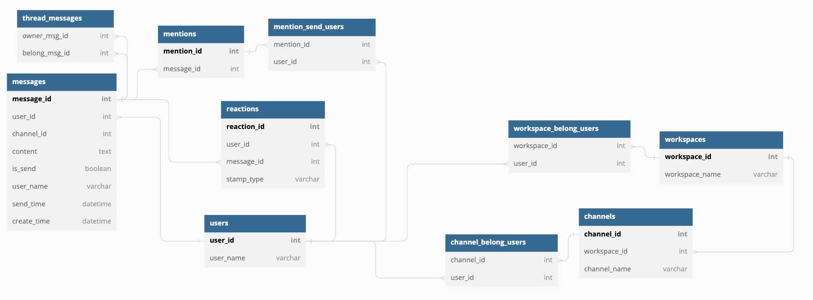

# ER図

特定のワークスペースのuser一覧
with selected_workspace as(select * from praha_slack.workspaces where workspace_id = 2)
select * from selected_workspace 
inner join praha_slack.workspace_belong_users Using(workspace_id)
inner join praha_slack.users Using(user_id);

特定のチャンネルのuser一覧
with selected_channel as (select * from praha_slack.channels where channel_id = 3)
select * from selected_channel
inner join praha_slack.channel_belong_users Using(channel_id)
inner join praha_slack.users Using(user_id);

あるワークスペースの特定のuserが入っているchannel一覧
with selected_workspace as(select * from praha_slack.workspaces where workspace_id = 1)
select * from selected_workspace 
inner join praha_slack.channels Using(workspace_id)
inner join praha_slack.channel_belong_users Using(channel_id)
where user_id = 12;

あるチャンネルの90日前までのメッセージ一覧
with recent_msg as(select * from praha_slack.messages where send_time > '2022-09-4 14:00:00' and channel_id = 4)
select * from recent_msg 
left outer join praha_slack.thread_messages on message_id = belong_msg_id
where belong_msg_id is null;

あるチャンネルの90日前までのメッセージのスレッド一覧
with recent_msg as(select * from praha_slack.messages where send_time > '2022-09-4 14:00:00' and channel_id = 4)
select * from recent_msg 
inner join praha_slack.thread_messages on message_id = belong_msg_id

あるチャンネルの90日前までのメッセージの横断検索
with recent_msg as(select * from praha_slack.messages where send_time > '2022-09-4 14:00:00' and channel_id = 4)
select * from recent_msg 
left outer join praha_slack.thread_messages on message_id = belong_msg_id
where content LIKE '%る%';